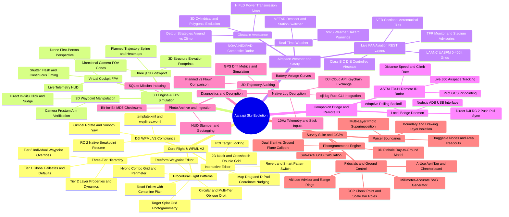
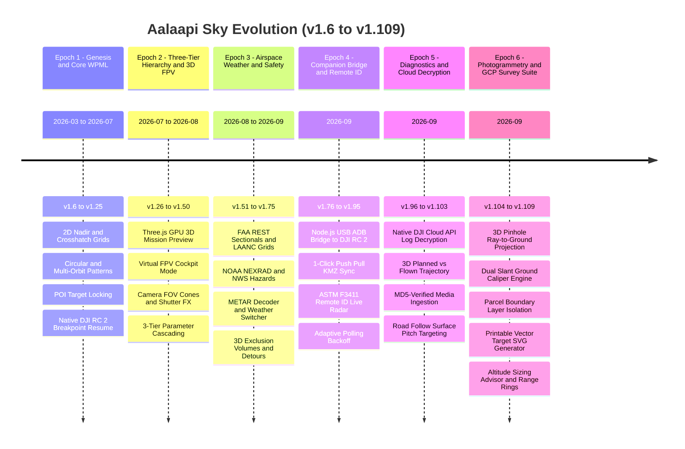

# Aalaapi Sky • Architectural Evolution & Project Mindmap (v1.6.10 → v1.109.0)

A comprehensive architectural evolution map and chronological progression of **Aalaapi Sky**, spanning 303 releases from foundational 2D grid generation to a survey-grade photogrammetry and ground control suite.

---

## 1. Architectural Capability Mindmap (Mermaid)

---

## 2. Chronological Milestones Timeline (Mermaid)

---

## 3. Major Evolution Epochs

### **Epoch 1: Genesis & Core WPML Engine (v1.6.10 – v1.25.0)**
* **Period:** March 2026 – July 2026
* **Key Achievements:**
  - Browser-native client-side flight planning using Leaflet 2D mapping engine.
  - Procedural flight generators: 2D Nadir Grid, 3D Crosshatch Double Grid, Circular Orbit, Multi-Orbit, Hybrid Combo, Freeform waypoints.
  - Full adherence to the **DJI WPML V2 (Waypoint Markup Language)** XML specification (`template.kml` and `waylines.wpml`).
  - Native **DJI RC 2 Breakpoint Resume** support for seamless multi-battery missions.
  - Point of Interest (POI) focal target locking with real-time trigonometric yaw calculation.
  - Smart pattern switching that preserves user waypoint nudging and customizations.

### **Epoch 2: Three-Tier Hierarchy & 3D FPV Simulation (v1.26.0 – v1.50.0)**
* **Period:** July 2026 – August 2026
* **Key Achievements:**
  - Architectural consolidation into the **Three-Tier Parameter Cascading Hierarchy** (`Global Default -> Layer Property -> Waypoint Override`).
  - High-performance GPU-accelerated **Three.js 3D Mission Preview** with real-world altitude profiles and terrain meshes.
  - **Virtual Cockpit FPV (First Person View)** flight simulation with authentic drone gimbal perspectives.
  - Interactive cockpit flight telemetry HUD (AGL Altitude, Ground Speed, Gimbal Pitch, Compass Heading).
  - Realistic camera field-of-view (FOV) sensor pyramids and photogrammetry overlap density heatmaps.
  - Camera shutter flash animations and dwell timing modeling.

### **Epoch 3: Airspace, Weather & Safety Architecture (v1.51.0 – v1.75.0)**
* **Period:** August 2026 – September 2026
* **Key Achievements:**
  - Direct integration with official **FAA REST endpoints**: VFR Sectional chart raster tiles, Controlled Airspace (Class B/C/D/E), Special Use Airspace (MOAs, Restricted).
  - **UAS Facility Maps (LAANC)** 0–400 ft altitude ceiling grids with direct map labels.
  - Live **NOAA NEXRAD** composite reflectivity weather radar and **NWS Hazard Warnings** (watches/warnings/advisories).
  - Live METAR decoder with multi-station switcher and flight category pills (VFR, MVFR, IFR, LIFR).
  - **HIFLD High-Voltage Power Transmission Lines** hazard overlay at zoom $\ge 11$.
  - 3D Exclusion Volumes (cylinders and polygons) with dual detour climbing strategies (Avoid Around vs Over-the-Top climb).

### **Epoch 4: Companion Bridge, ADB & Live Remote ID (v1.76.0 – v1.95.0)**
* **Period:** September 2026
* **Key Achievements:**
  - Lightweight local **Companion Bridge daemon** (`tools/companion/server.js`) running Node.js / Express / WebSocket.
  - Direct USB ADB communication with DJI smart controllers (DJI RC 2) on Android.
  - **1-Click Push/Pull KMZ Sync** directly into `/DJI/Fly/Waypoints`.
  - **ASTM F3411 Remote ID Airspace Radar** decoding live broadcast signals for 360° airspace awareness.
  - Real-time tracking of airborne drone targets, speeds, climb rates, and ground control pilot locations.
  - Stepped adaptive polling backoff and HTML5 Page Visibility listeners reducing offline traffic by ~98%.

### **Epoch 5: Flight Diagnostics & Cloud Log Decryption (v1.96.0 – v1.103.0)**
* **Period:** September 2026
* **Key Achievements:**
  - Native **DJI Developer Cloud API keychain decryption** for encrypted Fly logs (`FlightRecord_*.txt`) via Rust-based `dji-log` CLI.
  - 3D flight diagnostics replay engine comparing planned waypoint trajectories against actual flown GPS paths.
  - GPS drift deviation analytics, battery cell voltage curves, and RC stick deflection forensics.
  - Media Ingestion with triple-barrier cryptographic **MD5 checksum verification** before safely unlinking SD card files.
  - Photo geotagging and high-resolution Telemetry HUD Stamper.
  - **Road Follow Dynamic Gimbal Tilt** with automatic road surface focus (`-atan2(altitude, |offset|)`).

### **Epoch 6: Photogrammetry & Ground Control Survey Suite (v1.104.0 – v1.109.0)**
* **Period:** September 2026
* **Key Achievements:**
  - 3D forward pinhole ray-to-ground projective camera model (`projectGeoPointToPixel`, `projectPixelToGroundPlane`).
  - **Dual Slant vs Ground Plane Caliper Calibration** eliminating roof and structure measurement inflation.
  - First-class Boundary & Parcel Drawing layers with multi-layer photo superimposition and 0-waypoint safety guarantee.
  - **Ground Control Points (GCPs)**, Check Points, Scale Bars, and Origin Anchors.
  - Millimeter-accurate printable vector SVG target generator (ArUco 4x4, ArUco 5x5, AprilTag 16h5, Checkerboard, AeroPoint).
  - Photogrammetric **Altitude-Based GSD Advisor** and interactive 2D Optical Detection Range Rings ($R_{	ext{ground}}$).

---

## 4. Key Metrics Summary

| Metric | Value | Significance |
| :--- | :--- | :--- |
| **Total Git Releases** | **303 Releases** | Continuous rapid iteration from v1.6.10 to v1.109.0 |
| **Major Epochs** | **6 Epochs** | Systematic progression across flight planning, 3D, safety, hardware, diagnostics, and survey |
| **Flight Pattern Engines** | **8 Engines** | Nadir Grid, Double Grid, Orbit, Multi-Orbit, Hybrid, Multi-Hybrid, Road Follow, Freeform |
| **Parameter Architecture** | **3-Tier Cascade** | Strict hierarchy: Waypoint Override $	o$ Layer Property $	o$ Global Default |
| **Test Suite Coverage** | **694 Automated Tests** | Comprehensive unit & Playwright E2E verification suite |
| **Runtime Dependencies** | **0 Bundler Dependencies** | Browser-native ES6+ running cleanly without complex build systems |
